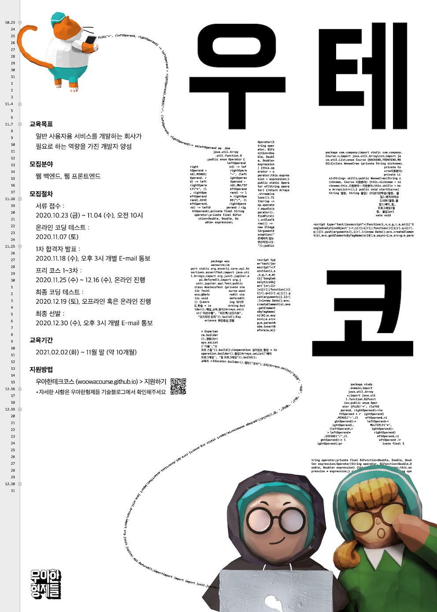

# Woowacourse-projects

 

[우아한테크코스](https://woowacourse.github.io/) 에서 진행했던 내용을 정리하기 위한 저장소입니다.

 

## Pre-course

### 기간
- 2020.11.25 – 2020.12.16

### 진행 미션

|Project|Repository|Pull Request|
|----|----|------|
|숫자 야구 게임|[java-baseball-precourse](https://github.com/ohjoohyung/java-baseball-precourse/tree/ohjoohyung)|[PR](https://github.com/woowacourse/java-baseball-precourse/pull/306)|
|자동차 경주 게임|[java-racingcar-precourse](https://github.com/ohjoohyung/java-racingcar-precourse/tree/ohjoohyung)|[PR](https://github.com/woowacourse/java-racingcar-precourse/pull/280)|
|지하철 노선도 미션|[java-subway-map-precourse](https://github.com/ohjoohyung/java-subway-map-precourse/tree/ohjoohyung)|[PR](https://github.com/woowacourse/java-subway-map-precourse/pull/47)|
|프리코스 후기|[후기](https://ohcodingdiary.tistory.com/25)|

 

## 최종 코딩 테스트

### 기간
- 2020.12.19

### 진행 미션

|Project|Repository|Pull Request|
|----|----|------|
|지하철 노선도 경로 조회 미션|[java-subway-path-precourse](https://github.com/ohjoohyung/java-subway-path-precourse/tree/ohjoohyung)|[PR](https://github.com/woowacourse/java-subway-path-precourse/pull/17)|

 

## Level 1 - TDD, OOP, Clean Code, Refactoring

### 기간
- 2021.02.03 – 2021.04.02

### 진행 미션

|Project|Repository|Pull Request|
|----|----|------|
|자동차 경주|[java-racingcar-step1](https://github.com/ohjoohyung/java-racingcar/tree/step1)|[PR](https://github.com/woowacourse/java-racingcar/pull/164)|
| |[java-racingcar-step2](https://github.com/ohjoohyung/java-racingcar/tree/step2)|[PR](https://github.com/woowacourse/java-racingcar/pull/224)|
|로또|[java-lotto-step1](https://github.com/ohjoohyung/java-lotto/tree/step1)|[PR](https://github.com/woowacourse/java-lotto/pull/252)|
| |[java-lotto-step2](https://github.com/ohjoohyung/java-lotto/tree/step2)|[PR](https://github.com/woowacourse/java-lotto/pull/311)|
|블랙잭|[java-blackjack-step1](https://github.com/ohjoohyung/java-blackjack/tree/step1)|[PR](https://github.com/woowacourse/java-blackjack/pull/144)|
| |[java-blackjack-step2](https://github.com/ohjoohyung/java-blackjack/tree/step2)|[PR](https://github.com/woowacourse/java-blackjack/pull/185)|
|체스|[java-chess-step1](https://github.com/ohjoohyung/java-chess/tree/step1)|[PR](https://github.com/woowacourse/java-chess/pull/199)|
| |[java-chess-step2](https://github.com/ohjoohyung/java-chess/tree/step2)|[PR](https://github.com/woowacourse/java-chess/pull/255)|
|JS 투두리스트|[js-todo-list-step1](https://github.com/ohjoohyung/js-todo-list-step1/tree/ohjoohyung)|[PR](https://github.com/woowacourse/js-todo-list-step1/pull/25)|

 

## Level 2 - Web, Spring Framework, Deployment

### 기간
- 2021.04.13 – 2021.06.04

### 진행 미션

|Project|Repository|Pull Request|
|----|----|------|
|체스|[jwp-chess-step1,2](https://github.com/ohjoohyung/jwp-chess/tree/step1)|[PR](https://github.com/woowacourse/jwp-chess/pull/256)|
| |[jwp-chess-step3](https://github.com/ohjoohyung/jwp-chess/tree/step2)|[PR](https://github.com/woowacourse/jwp-chess/pull/295)|
|지하철 노선도 관리|[atdd-subway-step1,2](https://github.com/ohjoohyung/atdd-subway-map/tree/step1)|[PR](https://github.com/woowacourse/atdd-subway-map/pull/78)|
| |[atdd-subway-step3](https://github.com/ohjoohyung/atdd-subway-map/tree/step2)|[PR](https://github.com/woowacourse/atdd-subway-map/pull/131)|
|지하철 경로 조회|[atdd-subway-path1,2](https://github.com/ohjoohyung/atdd-subway-path/tree/step1)|[PR](https://github.com/woowacourse/java-blackjack/pull/144)|
| |[atdd-subway-path3](https://github.com/ohjoohyung/atdd-subway-path/tree/step2)|[PR](https://github.com/woowacourse/atdd-subway-path/pull/113)|
|지하철 협업 미션|[atdd-subway-fare1,2,3,4](https://github.com/ohjoohyung/atdd-subway-fare/tree/step1)|[PR](https://github.com/woowacourse/atdd-subway-fare/pull/25)|

 

## Level 3 - Team Project

### 기간
- 2021.06.22 – 2021.10.29

### 진행 프로젝트
- [보고 또 보고](https://github.com/woowacourse-teams/2021-botobo)
- [서비스 주소](https://botobo.kr)

### 활동 내용
- [PR](https://github.com/woowacourse-teams/2021-botobo/pulls?page=1&q=assignee%3A%40me+is%3Aclosed)
- [3차 데모데이 발표](https://youtu.be/Syd2tk40Xp0)

 

## Level 4 - HTTP Server, MVC Framework, JDBC Library

### 기간
- 2021.08.24 – 2021.10.29

### 진행 미션

|Project|Repository|Pull Request|
|----|----|------|
|HTTP 서버 구현하기|[jwp-dashboard-http-step1](https://github.com/ohjoohyung/jwp-dashboard-http/tree/step1)|[PR](https://github.com/woowacourse/jwp-dashboard-http/pull/23)|
| |[jwp-dashboard-http-step2,3](https://github.com/ohjoohyung/jwp-dashboard-http/tree/step2)|[PR](https://github.com/woowacourse/jwp-dashboard-http/pull/82)|
|MVC 프레임워크 구현하기|[jwp-dashboard-mvc-step1](https://github.com/ohjoohyung/jwp-dashboard-mvc/tree/step1)|[PR](https://github.com/woowacourse/jwp-dashboard-mvc/pull/34)|
| |[jwp-dashboard-mvc-step2,3](https://github.com/ohjoohyung/jwp-dashboard-mvc/tree/step2)|[PR](https://github.com/woowacourse/jwp-dashboard-mvc/pull/70)|
|JDBC 라이브러리 구현하기|[jwp-dashboard-jdbc-step1,2](https://github.com/ohjoohyung/jwp-dashboard-jdbc/tree/step1)|[PR](https://github.com/woowacourse/jwp-dashboard-jdbc/pull/15)|
|조회 성능 개선하기|[sql-tuning](https://github.com/ohjoohyung/sql-tuning/tree/step1)|[PR](https://github.com/woowacourse/sql-tuning/pull/35)|
|레거시 코드 리팩토링|진행 중||

 

## 글쓰기 미션

|Project|Repository|Pull Request|
|----|----|------|
|Level 1 글쓰기|[우아한테크코스 한 달 생활기](https://github.com/ohjoohyung/woowa-writing-3/tree/ohjoohyung/level1)|[PR](https://github.com/woowacourse/woowa-writing-3/pull/55)|
|Level 2 글쓰기|[우아한테크코스에서 찾은 나만의 효과적인 공부법](https://github.com/ohjoohyung/woowa-writing-3/tree/ohjoohyung/level2)|[PR](https://github.com/woowacourse/woowa-writing-3/pull/119)|
|Level 3 글쓰기|[팀 프로젝트가 나에게 남긴 것](https://github.com/ohjoohyung/woowa-writing-3/tree/ohjoohyung/level3)|[PR](https://github.com/woowacourse/woowa-writing-3/pull/232)|
|Level 4 글쓰기|[내가 꿈꾸는 프로그래머로서의 삶](https://github.com/ohjoohyung/woowa-writing-3/tree/ohjoohyung/level4)|[PR](https://github.com/woowacourse/woowa-writing-3/pull/298)|